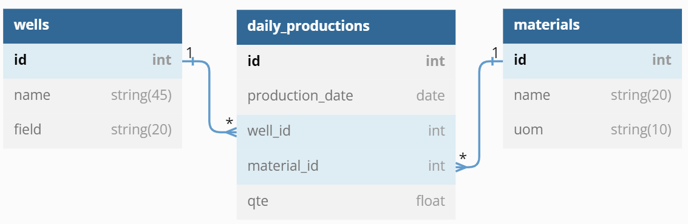
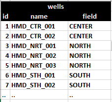
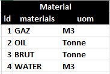
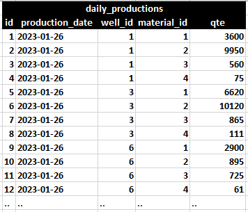

# A RESTFUL FastAPIs for Oil & Gaz Daily Production

The APIs are related to an oil company core activities, which includes, in particular, Oil and Gaz Daily Production.

## The DataBase:


Where:

1. The `wells` table represents the different wells ("`Puits`" in French) A sample of data rows of this table is shown
   in the following Figure:

<figure>
  
</figure>

2. The `materials` table represents the different materials produced. A sample of data rows of this table is shown in
   the following Figure:

<figure>
  
</figure>

3. The `daily_productions` table represents the wells daily production by material produced. A sample of data rows of
   this table is shown in the following Figure:

<figure>
  
</figure>

#### Note that:

* All tables attributes are not nullable.
* The `name` attribute in both the `wells` and `materials` tables is `unique`.
* In the `daily_productions` table, there is a composite unique constraint composed
  of  (`production_date`, `well_id`, `material_id`).
* The only accepted values for the attribute `field` in table `wells` are: `CENTER`, `NORTH`, or `SOUTH`.
* The only accepted values for the attribute `uom` in table `materials` are: `M3` or `Tonne`.

## Available APIs

| User Request | App routes | Description |
| --- | --- | --- |
| GET | /wells | Get all wells |
|  | /wells/{id} | Get a well with a given id |
|  | /materials | Get all materials |
|  | /materials/{name} | Get a Material with a given name |
|  | /productions/wells/{well_id} | Get  all the daily productions of a given well id |
|  | /productions/date/{prod_date} | Get  all the daily productions at a  given date |
|  |  |  |
| POST | /wells/new | Create a new well |
|  | /materials/new | Create a new material |
|  | /productions/new/{well_id}/{material_id} | Create a new production for a given well id and a given material id |
|  |  |  |
| DELETE | /productions/delete/{material_name}/{well_id}/{prod_date} | Delete the daily production of a given material id for a given well id at a given date |
|  |  |  |
| PUT | /wells/update/{id} | Update a well with a given id |

## Getting Started
Install the requirements and run the following commands:
```bash
pip install .
uvicorn app.main:app
```
